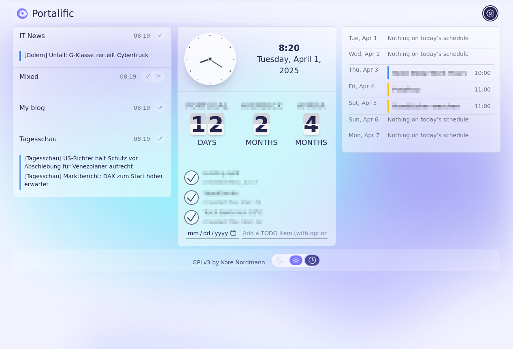
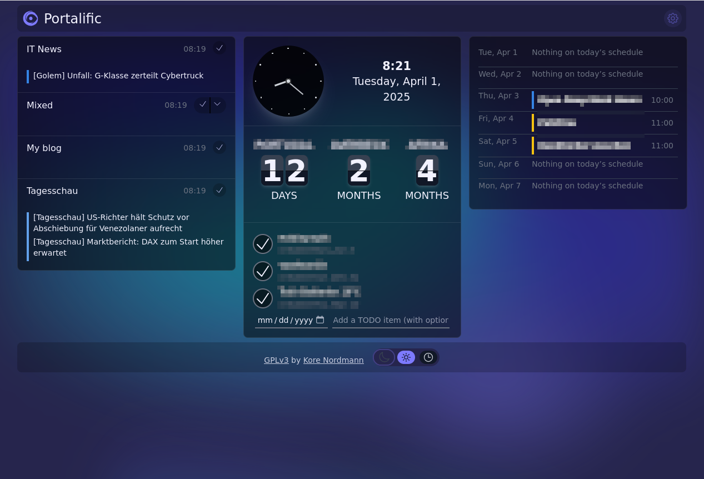
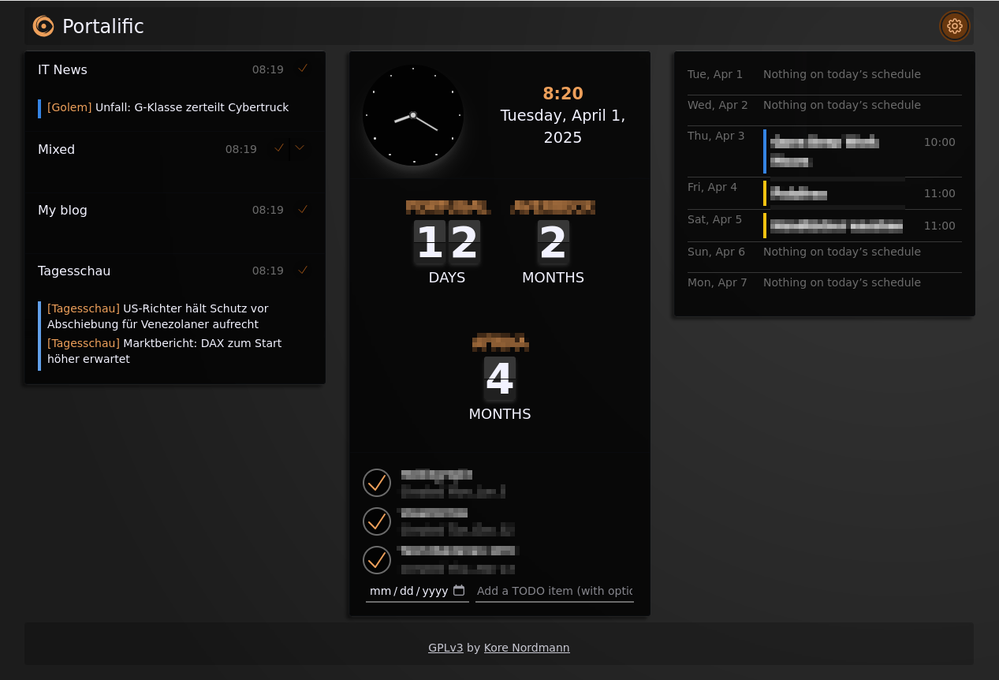
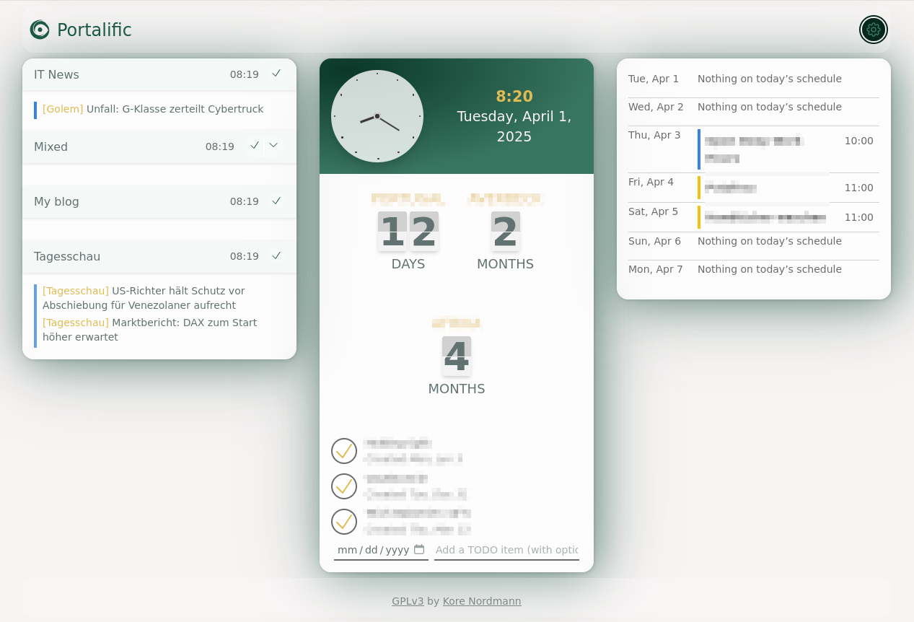
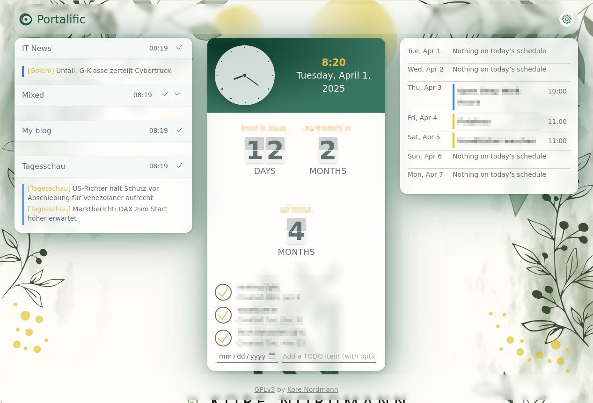

## About

Portalific is an OpenSource browser based portal, displaying your feeds, your
calendars, and other information of personal relevance. It works (almost)
entirely browser-based, so your data is safe and secure. For cross-device
synchronization you can optionally use a backend to synchronize the data
continuously between devices.



For more information visit https://portalific.com

### Themes

There're different themes available, where you can also customize the
background using colors or images. Custom theme could be developed using BEM
based styling as you can see when checking out the exsting themes in
`styles/theme-*.scss`.

   

### Setting Up Locally

From there, you can install the project's dependencies by running:

```shell
yarn install
```

Finally, you can run your project locally with:

```shell
yarn run dev
```

Open your browser and visit <http://localhost:3000>, your project should be
running! You can, if you want to, also import a test configuration using
http://localhost:3000/setup?identifier=test-data

### Dependencies

Because of CORS we need an allow proxy to request data (RSS feed, ICAL, …) from
external sources. An example written in PHP can be found at
`docs/allowProxy.php` or at https://local-storage-storage.io/#proxy-request.

## Ideas

A list of ideas and features which might be implemented at some point to give
you an idea of where this software is heading.

### Modules to create

- [ ] Simple weather module

### Improved offline support

Next to the current settings and module configurations a module data storage
can be introduced which is filled asynchronously by service workes in the
background. Currently all module data (see feed, calendar) is only stored in
the local state of the module components, which makes them volatile and prune
to outages.

### Different environment modes

It could make sense to show different modules in different envuironment modes,
think of:

- Work
- Relax
- Travelling
- Vacation

Those could be explicitly chosen, but also be based on time/date, location,
and/or device.

This will especially make sense for TODO lists and shown calendars.
